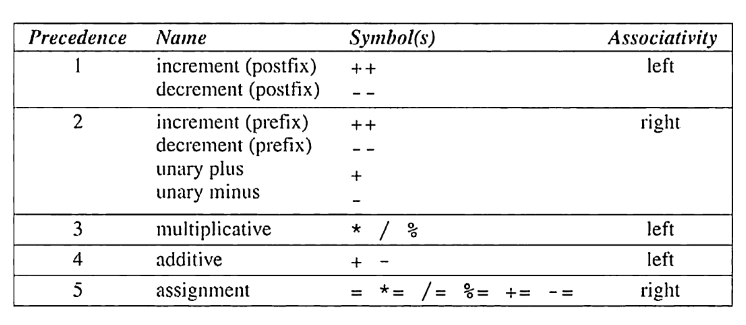

## Arithmatic Operators

The arithmetic operators:

{fig-align="center" width="350"}

-   Additive and multiplicative operators are binary because they require *two* operands.

-   The unary operators require *one* operand:

    -   `i = +1` where `+` is used as a unary operator

    -   `j = -i` where `-` is used as a unary operator

Unary + operator does nothing, and wasn't even included in K&R's C. It is generally used to emphasize that it is a constant is positive.

Binary operators, with the exception of `%`, allow for mixing integers and floating-point numbers.

-   When an `int` and `float` are mixed, the result is of type `float`

    -   e.g. `9 + 2.5 = 11.5`

The `/` and `%` operators are a bit different:

-   The `/` can produce unusual results, because when both operands are integers, the `/` truncates the result by dropping the fractional part

    -   e.g. `1/2 = 0`

-   The `%` operator require integer operands, otherwise it won't compile.

-   A zero on either side of `/` or `%` will cause undefined behavior.

-   C89 and C99 handle negative numbers with `/` and `&` different:

    -   C98: If either operand is negative, the result can be rounded up or down (depends on implementation)

    -   C99: The results if either operand is negative are always truncated down towards zero

        -   e.g. `-9/7 = -1` and `-9%7 = -2`

#### Implementation defined behavior

The C standard deliberately left parts of the language unspecified with the understanding that "implementation", or the software needed to compile, link, and execute program on a specific platform, will fill in the details.

-   Because of this, some programs may behave differently on different platforms.

-   This is a bit dangerous but it reflect's C's philosophy - keep it efficient.

### Operator Precedence and Associativity

C uses **operator precedence** to resolve ambiguity in how expressions are evaluated It follows the following relative precedence:

|         |                |          |
|:-------:|:--------------:|:--------:|
| Highest |   `+` , `-`    | (unary)  |
|         | `*` , `/`, `%` |          |
| Lowest  |    `+`, `-`    | (binary) |

An operand is said to be **left associative** if it groups from left to right.

-   The binary arithmetic operators (`*`, `/`, `%`, `+`, and `-`) are all left associative. Therefore,

-   `i - j - k == (i - j) - k`

-   `i * j / k == (i * j / k)`

Operands are said to be **right associative** if it groups from right to left. The unary operators `+` and `-` are right associative, therefore:

-   `- + i == -(+i)`

#### Computing a UPC Check Digit

Products in US and Canada have a bar code, a Universal Product Code (UPC), that identifies the manufacturer and the product.

-   Each barcode is a 12-digit number, that is usually printed underneath the bars.
-   For example, 0 13800 15173 5 are the digits for a package of Stouffer's French Bread Pepperoni Pizza.
    -   The first digit identifies the type of item (0-7)
        -   2 that needs to be weighed, 3 for drugs/health, 6 for coupons
    -   The next group of 5 digits is the manufacturer code (e.g. 13800 is Nestle)
    -   The next 5 digits identifies the product (including the size)
    -   The final digit is the *check digit* that helps identify errors in the preceding digits.
        -   If the UPC is scanned incorrectly, the first 11 digits won't be consistent with the check digit, and it will be rejected.

How the check digit is calculated:

1.  Add the first, third, fifth, seventh, ninth, and eleventh digits
2.  Add the second, fourth, sixth, eighth, and tenth digits
3.  Multiply the first sum by 3 and add it to the second sum
4.  Subtract 1 from the total
5.  Divide by 10
6.  Subtract the remainder from 9

For the Stouffer's example:

1.  0 + 3 + 0 +1 +1 +3 = 8
2.  1 + 8 + 0 + 5 + 7 = 21
3.  24 + 21 = 45
4.  45 - 1 = 44
5.  44 / 10 = 4.4 or 4
6.  9 - 4 = 5

We can write a program that creates a check digit based on UPC groups:

```         
Enter the first (single) digit: 0
Enter the first group of five digits: 13800
Enter the second group of five digits: 15173
Check digit: 5
```

-   We will read each 5-digit grouping as five 1-digit numbers.

``` c
/* Computes a Universal Product Code check digit */

#include <stdio.h>

int main(void)
{
    int d, i1, i2, i3, i4, i5, j1, j2, j3, j4, j5,
        first_sum, second_sum, total;

    printf("Enter the first (single) digit: ");
    scanf("%1d", &d);
    printf("Enter first group of five digits: ");
    scanf("%1d%1d%1d%1d%1d", &i1, &i2, &i3, &i4, &i5);
    printf("Enter second group of five digits: ");
    scanf("%1d%1d%1d%1d%1d", &j1, &j2, &j3, &j4, &j5);

    first_sum = d + i2 + i4 + j1 + j3 + j5;
    second_sum = i1 + i3 + i5 + j2 + j4;
    total = 3 * first_sum + second_sum;

    printf("Check digit: %d\n", 9 - ((total - 1) % 10));

    return 0;

}
```

## Assignment Operators

C's `=` (simple assignment) operator is used to store a value in a variable to use later.

-   For updating a value that is already stored n a variable, C has compound assignment operators.

### Simple assignment

-   `v = e` evaluates the expression `e` and copies its value into `v`

-   `v` and `e` doesn't have to be the same type. The value of `e` will be converted to type `v` when the assignment takes place.

While many languages treat assignment as a statement, in C, assignment is an **operator**, just like `+`.

-   The act of assignment produces a result, just as adding two numbers produces a result.

-   The value of an assignment `v = e` is the value `v` *after* the assignment.

    -   e.g. The value `i = 72.99f` is 72 not 72.99

#### Side effects

-   Most operators don't modify their operands - `i + j` doesn't modify `i` or `j`, just, computes the sum of `i` and `j`.

-   Some operators have **side effects** as they do more than just compute their value.

    -   The assignment operator has side effects as it modifies the left operand.

        -   `i = 0` produces the result 0 with a side effect of assigning 0 to `i`

Since assignment is an operator, several can be changed together: `i = j = k = 0;`

-   The `=` operator is right associative, so `i = j = k = 0;` is equal to `i = (j = (k = 0));`

**Note** - Be careful of unexpected results in chained assignments as a result of type conversion:

``` c
int i;
float f;

f = i = 33.3f;
```

-   `i` is assigned the value of 33, then `f` is assigned 33.0 (not 33.3)

The form `v = e` is generally allowed whenever a value of type `v` would be permitted. For example:

``` c
i = 1;
k = 1 + (j = i);
printf("%d %d %d\n", i , j , k); /* prints "1 1 2" */
```

-   `j = i` copies `i` to `j`

-   The new value of `j` is then added to `1`, giving `k` the value of 2.

-   This is not a recommend way of assignment as "embedded assignments" are hard to read and can be a source of subtle bugs.

### Lvalues

The assignment operator requires an **lvalue**, which is the left operand.

-   The lvalue represents an object stored in memory, not a constant or a result of a computation.

-   Variables are lvalues, whereas expressions are not (`10`, `2*i`, etc)

### Compound assignment

Suppose we want to increase a variable's value by 2:

``` c
i = i + 2;
```

We can also use C's **compound assignments** to shorten these types of statements:

``` c
i += 2; /* same as i = i + 2*/
```

-   The value of the right operand is added to the variable on the left.

The most popular compound assignment operators:

-   `v += e` adds `v` to `e`, storing the result in `v`

-   `v -= e`

-   `v *= e`

-   `v /= e`

-   `v %= e`

**Note:** `v += e` is not equivalent to `v = v + e`

-   One problem is the operator precedence: `i *= j + k` isn't the same as `i = i * j + k`

-   There are cases where `v += e` differs from `v = v + e` because `v` itself has a side effect.

-   This applies to the other compound assignment operators

Compound assignment operators have the same properties as the `=` operator (e.g. right associative):

``` c
/* These are equivalent */
i += j += k;
i += (j += k);
```

## Increment and Decrement operators

C allows increments and decrements to be shortened using the `++` (**increment**) and `--` (**decrement**)

-   These can be used as **prefix** operators (e.g. `++i` and `--i`)

-   These can be used as **postfix** operators (e.g. `i++` and `i--`

Like assignment operators, they have side effects.

-   Prefix (`++i`) does a pre-increment, where it does `i + 1` and as a side effect, increments `i\`

    -   This means - "increment `i` immediately".

-   Postfix (`i++`) does the post-increment, where it produces the result `i` and as a side effect, increments it afterwards.

    -   This means "use the old value of `i` for now, and then increment `i` later"

    -   **Note:** The C standard doesn't specify an exact time when it increments `i` later, but it's assumed that it will be incremented before the next statement is executed.

``` c
i = 1
printf("i is %d\n", i++); /* prints "i is 1" */
printf("i is %d\n", i); /* prints "i is 2" */
```

The postfix versions of `++` and `==` have:

-   Higher precedence than unary plus and minus

-   Are right associative

## Expression Evaluation

The most common operators with their precedence (highest is 1) , symbol, and associativity:

{fig-align="center" width="500"}

Suppose we have the following expression:

``` c
a = b += c++ - d + --e / - f
```

-   The highest precedence is postfix `++`, which gives the equivalent expression `a = b += (c++) - d  --e / -f`

-   The next highest is prefix `--` and unary `-`, with a precedence of 2, which gives us `a = b += (c++) - d + (--e) / (-f)`

    -   Since the other `-` is to the left it must be subtraction not unary

-   The next highest is `/` with a precedence of 3, which gives us `a = b += (c++) - d + ((--e) / (-f))`

-   The next highest is 4, with both a `+` and a `-`.

    -   These are associative left, so the parentheses go around the subtraction first then adding both parentheses groups, which gives us `a = b += (((c++) - d) + ((--e / (-f)))`

-   Lastly, we have the assignments `=` and `+=` that are both 5s, which gives us `(a = (b += ((c++) - d + ((--e) / (-f)))))`

### Order of subexpression evaluation

C doesn't define the order in which subexpressions are evaluated with the exception of ones involving logical *and*, logical *or*, conditional, and comma operators.

-   This means for the expression `(a + b) * (c - d)`, we don't know if `(a + b)` is evaluated before/after `(c-d)`

**Note:** Avoid writing expressions that access the value of a variable and also modify the variable elsewhere in the expression. For example:

``` c
(b = a + 2) 0 (a = 1)
```

-   This accesses the value of `a` to compute `a + 2` but also modifies the value of `a` by assigning it to 1.

-   Your better off using assignment operators in subexpressions:

``` c
a = 5;
b = a + 2;
a = 1;
c = b = a;
```

Besides assignment operators, increment and decrement are the only operators that modify their operands. Make sure to be careful using these so they don't depend on a particular order of operations:

-   e.g. `i = 2; j = i * i++;`

This is an example of **undefined behavior**, which means it the results are dependent on the compiler. Programs could fail to compile, return/assign a random value, or crash.

## Expression Statements

Any expression can be used as a statement regardless of the type or what it computes.

-   Ending an expression with a semicolon turns it into a statement.

-   `i++;` is a valid statement