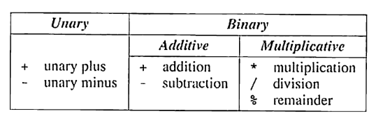

## Arithmatic Operators

The arithmetic operators:

{fig-align="center" width="350"}

-   Additive and multiplicative operators are binary because they require *two* operands.

-   The unary operators require *one* operand:

    -   `i = +1` where `+` is used as a unary operator

    -   `j = -i` where `-` is used as a unary operator

Unary + operator does nothing, and wasn't even included in K&R's C. It is generally used to emphasize that it is a constant is positive.

Binary operators, with the exception of `%`, allow for mixing integers and floating-point numbers.

-   When an `int` and `float` are mixed, the result is of type `float`

    -   e.g. `9 + 2.5 = 11.5`

The `/` and `%` operators are a bit different:

-   The `/` can produce unusual results, because when both operands are integers, the `/` truncates the result by dropping the fractional part

    -   e.g. `1/2 = 0`

-   The `%` operator require integer operands, otherwise it won't compile.

-   A zero on either side of `/` or `%` will cause undefined behavior.

-   C89 and C99 handle negative numbers with `/` and `&` different:

    -   C98: If either operand is negative, the result can be rounded up or down (depends on implementation)

    -   C99: The results if either operand is negative are always truncated down towards zero

        -   e.g. `-9/7 = -1` and `-9%7 = -2`

#### Implementation defined behavior

The C standard deliberately left parts of the language unspecified with the understanding that "implementation", or the software needed to compile, link, and execute program on a specific platform, will fill in the details.

-   Because of this, some programs may behave differently on different platforms.

-   This is a bit dangerous but it reflect's C's philosophy - keep it efficient.

### Operator Precedence and Associativity

C uses **operator precedence** to resolve ambiguity in how expressions are evaluated It follows the following relative precedence:

|         |                |          |
|:-------:|:--------------:|:--------:|
| Highest |   `+` , `-`    | (unary)  |
|         | `*` , `/`, `%` |          |
| Lowest  |    `+`, `-`    | (binary) |

An operand is said to be **left associative** if it groups from left to right.

-   The binary arithmetic operators (`*`, `/`, `%`, `+`, and `-`) are all left associative. Therefore,

-   `i - j - k == (i - j) - k`

-   `i * j / k == (i * j / k)`

Operands are said to be **right associative** if it groups from right to left. The unary operators `+` and `-` are right associative, therefore:

-   `- + i == -(+i)`

#### Computing a UPC Check Digit

Products in US and Canada have a bar code, a Universal Product Code (UPC), that identifies the manufacturer and the product.

-   Each barcode is a 12-digit number, that is usually printed underneath the bars.
-   For example, 0 13800 15173 5 are the digits for a package of Stouffer's French Bread Pepperoni Pizza.
    -   The first digit identifies the type of item (0-7)
        -   2 that needs to be weighed, 3 for drugs/health, 6 for coupons
    -   The next group of 5 digits is the manufacturer code (e.g. 13800 is Nestle)
    -   The next 5 digits identifies the product (including the size)
    -   The final digit is the *check digit* that helps identify errors in the preceding digits.
        -   If the UPC is scanned incorrectly, the first 11 digits won't be consistent with the check digit, and it will be rejected.

How the check digit is calculated:

1.  Add the first, third, fifth, seventh, ninth, and eleventh digits
2.  Add the second, fourth, sixth, eighth, and tenth digits
3.  Multiply the first sum by 3 and add it to the second sum
4.  Subtract 1 from the total
5.  Divide by 10
6.  Subtract the remainder from 9

For the Stouffer's example:

1.  0 + 3 + 0 +1 +1 +3 = 8
2.  1 + 8 + 0 + 5 + 7 = 21
3.  24 + 21 = 45
4.  45 - 1 = 44
5.  44 / 10 = 4.4 or 4
6.  9 - 4 = 5

We can write a program that creates a check digit based on UPC groups:

```         
Enter the first (single) digit: 0
Enter the first group of five digits: 13800
Enter the second group of five digits: 15173
Check digit: 5
```

-   We will read each 5-digit grouping as five 1-digit numbers.