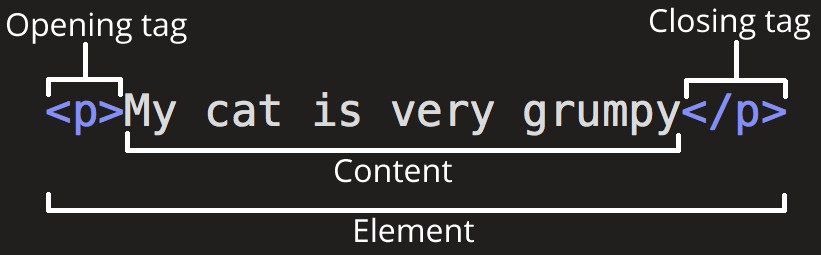
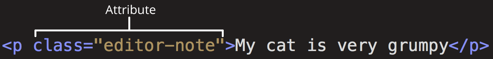
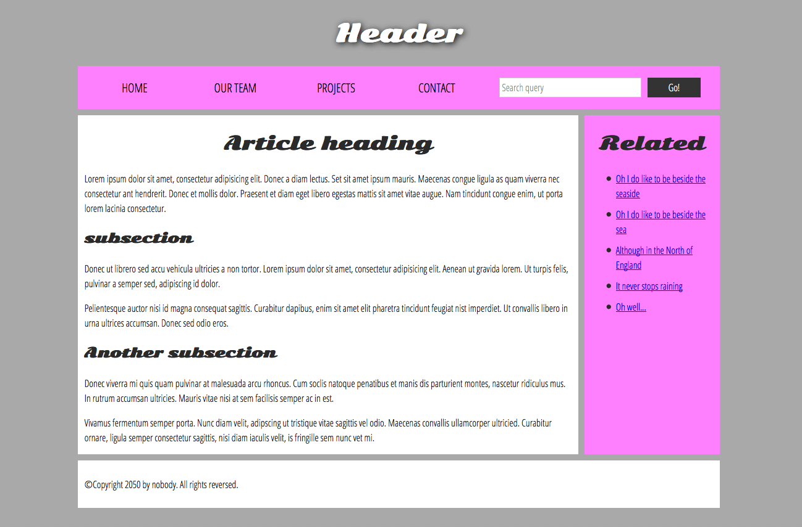
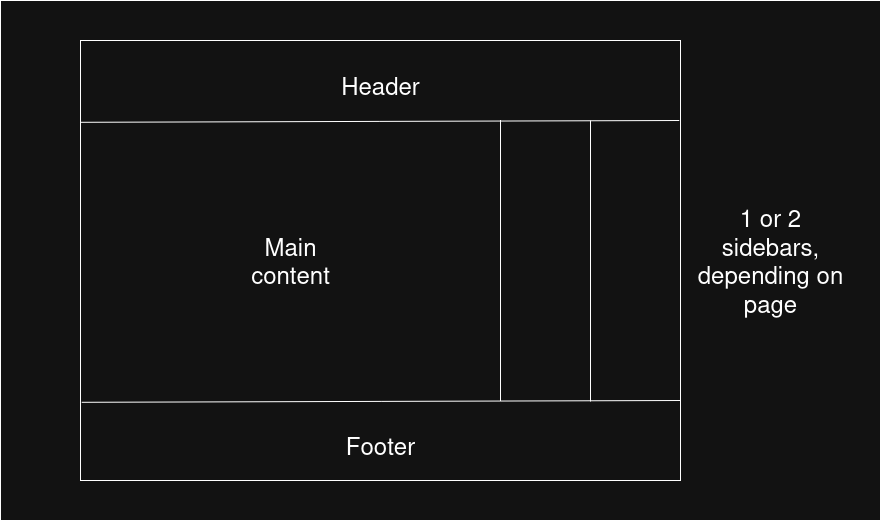

# HTML Syntx

## What is HTML?

HTML (HyperText Markup Language) is a *markup* *language* that tells web browsers how to structure a web page.

- HTML consists of a series of [elements]{.underline}, which is used to enclose, wrap, or mark up different parts of the content on a web page.

- The enclosing [tags]{.underline} can also make content a [hyperlink]{.underline}, which will link to another page.

- Tags in HTML are not case sensitive so `<title>` is the same as `<TiTlE>`, but the best practice is to use lowercase.

HTML lives inside of text files called **HTML documents** or **documents**, which have a `.html` extension.

- The most common HTML file is `index.html`, which contains a website's home page.

  - Subfolders can also have their own `index.html` files

### Anatomy of an HTML element

{fig-align="center" width="429"}

The complete element consists of:

- **Opening tag:** The name of the element (in this case `p` for paragraph). This marks the start of the element or where it starts to take effect

- **Content:** The content of the element

- **Closing tag:** The ending tag, which is where the element ends or stops taking effect.

Tags can also be applied inside of other tags, which is called [nested tags]{.underline}

``` html
<p> this is <em>strong</em> </p>
```

- Tags need to be closed in reverse order from which they were open

### Void elements

Not all elements follow the opening, content, and closing tag pattern. Some, like the `<br>` tag are only a single tag.

- These tags are called [void elements]{.underline} because the elements cannot contain other HTML content

``` html
<p>
    this is some text on the first line <br> this is the sencond line.
</p>
```

## Attributes

Elements can also have attributes:

{fig-align="center" width="495"}

Attributes contain additional information about the element that isn't part of its content.

- The [class]{.underline} attribute provides identifies specific elements that can be targeted in CSS or JavaScript

Attributes should have:

- Space between it and the element name. If an element has more than one attribute, they should be separated by a space

- Attributes should be `<name>=<value>`

- The attribute value should be wrapped in quotes

### Boolean attributes

These are attributes without a value.

- When they are added, the value is set to `true`, and if it it's not added, then it is `false`

For example,

`disabled` is an attribute that can be assigned to `<input` to stop the user from entering in data:

``` html
<label for="first-input">This input is disabled</label>
<input id="first-input" type="text" disabled="disabled" />
<br />
```

We can also write `disabled` without a value

``` html
<label for="first-input">This input is disabled</label>
<input id="first-input" type="text" disabled/>
<br />
```

## Anatomy of an HTML document

An example of a simple web page:

``` html
<!doctype html>
<html lang="en-US">
  <head>
    <meta charset="utf-8" />
    <title>My test page</title>
  </head>
  <body>
    <p>This is my page</p>
  </body>
</html>
```

- `<!doctype html>` Historical artifact that is required to make sure everything runs smoothly.

  - The shortest string of characters that can be classified as a web page

- `<html></html>` wraps all of the content on the page

  - Known as the root element

- `<head></head>` element acts as a container for information about the page that <u>isn't</u> part of the of the content that users will see.

  - Includes keywords, page descriptions of search engines, CSS, character set declarations, etc.

- `<meta charset="utf-8">` represents metadata that describes the page. The `charset` attribute specifies the character encoding your document will use.

  - The charset isn't required but it is a good idea to include to help avoid potential problems.

- `<title></title>` Sets the title on the page, which appears in the browser tab and used to describe the page when bookmarked.

- `<body></body>` Containts **all** the content that

## Whitespace

Whitespace is generally ignored but is helpful for making the code readable. For example, the following code snippets are equivalent:

``` html
<p id="noWhitespace">Dogs are silly</p>

<p id="whitespace">Dogs
    are
        silly</p>
```

The most common way of writing HTML is with nested elements with 2 spaces of indentation.

## Special characters

Character references are special codes used to print special characters:

| Special Character | Character Reference |
|:-----------------:|:-------------------:|
|        \<         |       `&lt;`        |
|        \>         |       `&gt;`        |
|         "         |      `&quot;`       |
|         '         |      `&apos;`       |
|         &         |       `&amp;`       |

To write "In HTML, you define a paragraph using `<p>` element":

``` html
<p>In HTML, you define a paragraph using &lt;p&gt; eleemnt</p>
```

## HTML comments

Comments can be made in line with `<!-- -->`

# HTML Metadata

## HTML head

``` html
<!doctype html>
<html lang="en-US">
    <head>
        <meta charset="utf-8">
        <title>My test page</title>
    </head>
    <body>
        <p>This is my page</p>
    </body>
</html>
```

- The head element contains metadata about the document.

- The `<title>` element is different than the `<h1>` element:

  - The `<h1>` element appears at the top of the page when the page is loaded.

  - The `<title>` element is metadata that represents the title of the overall HTML document (and shows up in the tab)

## Metadata: The `<meta>` element

The metadata element adds the metadata to the HTML document.

### Specifying character encoding

``` html
<meta charset="utf-8">
```

- `utf-8` is a universal character set for just about any character from any language.

- `name` attribute specifies the type of metadata

- `content` attribute specifies the meta content.

``` html
<meta name="author" content="Chris Mills" />
<meta
  name="description"
  content="The MDN Web Docs Learning Area aims to provide
complete beginners to the Web with all they need to know to get
started with developing websites and applications." />
```

- It is helpful to specify the author so everyone know who wrote the content.

- Specifying a description that includes keywords is helpful for SE

## Adding custom icons to the site

Favicons, or favorite icons, are a 16-pixel square that is usually shown next to the address bar or in the favorites menu. Then can be added to a page by:

1.  Saving the image in a format such as `.ico`, `.gif`, or `.png` within the website folder structure.
2.  Adding a `<link>` element into the `<head>` block, which references the path to the favicon file

``` html
<link rel="icon" href="/favicon.ico" type="image/x-icon">
```

- The favicon path starts with `/`, which looks at the top-level (root) directory of the site.

  - Web frameworks typically have a special folder for files in the site root, such as `static` or `public`

We can also have different icons for different contexts:

``` html
<link rel="icon" href="/favicon-48x48.[some hex hash].png" />
<link rel="apple-touch-icon" href="/apple-touch-icon.[some hex hash].png" />
```

## Applying CSS and JavaScript to HTML

The two most commonly way CCS/JS are applied to a web page is through `<link>` and `<script>` elements.

- The `<link>` element should always go inside the head of the document and takes two attributes

  - `rel="stylesheet"` indicates that it is a stylesheet

  - `href` containing the path to the stylesheet file

<!-- -->

- The `<script>` element also goes in the head and contains two attributes:

  - `src` attribute containing the path to the JS that will be loaded

  - `defer` (boolean) which instructs the browser to load the HS after the page is finished parsing the HTML.

    - The `defer` attribute is useful as it guarantees the HTML is loaded so JS won't cause errors when trying to access HTML elements that don't exist on the page yet.

``` html
<script src="my-js-file.js" defer></script>
```

## Emphasis and importance

The `<em>` tag gives emphasis to words. It shows up in most browsers as italics, but should not be used as italics (use `<i>` for italics fonts).

The `<strong>` element is used to stress or emphasize words, but like `<em>` should not be used to make words bold. In that case us `<b>`

### Presentational elements

Bold, italics, and underline (`<b>`, `<i>`, and `<u>`) were added before CSS was widely supported. These are presentational elements as they only affect the presentation, not the semantics

- Use presentational elements to convey traditional meaning.

- Use the semantic versions for all other cases.

## Lists

### Unordered lists

To create an unordered list, wrap the whole list in the `<ul>` element and wrap each item in a `<li>` element (list item):

``` html
<ul>
  <li>milk</li>
  <li>eggs</li>
  <li>bread</li>
  <li>hummus</li>
</ul>
```

For lists where order matters, such as instructions, we use `<ol>` (ordered list) instead of `<ul>`:

``` html
<ol>
  <li>Drive to the end of the road</li>
  <li>Turn right</li>
  <li>Go straight across the first two roundabouts</li>
  <li>Turn left at the third roundabout</li>
  <li>The school is on your right, 300 meters up the road</li>
</ol>
```

### Nesting lists

We can nest lists within other lists, which will create sub-bullets:

``` html
<ol>
  <li>Remove the skin from the garlic, and chop coarsely.</li>
  <li>Remove all the seeds and stalk from the pepper, and chop coarsely.</li>
  <li>Add all the ingredients into a food processor.</li>
  <li>Process all the ingredients into a paste.</li>
  <li>If you want a coarse "chunky" hummus, process it for a short time.</li>
  <li>If you want a smooth hummus, process it for a longer time.</li>
</ol>
```

### Description lists

Description lists are used to mark up a set of items and their descriptions, such as definitions, or questions/answers.

- `<dl>` is the wrapper over the whole list

- `<dt>` is the description term element

- `<dd>` is the description definition element

``` html
<dl>
  <dt>soliloquy</dt>
  <dd>
    In drama, where a character speaks to themselves, representing their inner
    thoughts or feelings and in the process relaying them to the audience (but
    not to other characters.)
  </dd>
  <dt>monologue</dt>
  <dd>
    In drama, where a character speaks their thoughts out loud to share them
    with the audience and any other characters present.
  </dd>
  <dt>aside</dt>
  <dd>
    In drama, where a character shares a comment only with the audience for
    humorous or dramatic effect. This is usually a feeling, thought, or piece of
    additional background information.
  </dd>
</dl>
```

We can have multiple definitions per term:

``` html
<dl>
  <dt>aside</dt>
  <dd>
    In drama, where a character shares a comment only with the audience for
    humorous or dramatic effect. This is usually a feeling, thought, or piece of
    additional background information.
  </dd>
  <dd>
    In writing, a section of content that is related to the current topic, but
    doesn't fit directly into the main flow of content so is presented nearby
    (often in a box off to the side.)
  </dd>
</dl>
```

## Advanced text features

### Blockquotes

A section or block of text that can be quoted with `<blockquote>` elements.

- We can include a URL pointing to the source with a `cite` attribute

``` html
<p>Here is a blockquote:</p>
<blockquote
  cite="https://developer.mozilla.org/en-US/docs/Web/HTML/Reference/Elements/blockquote">
  <p>
    The <strong>HTML <code>&lt;blockquote&gt;</code> Element</strong> (or
    <em>HTML Block Quotation Element</em>) indicates that the enclosed text is
    an extended quotation.
  </p>
</blockquote>
```

### Inline quotations

Inline quotes work the same as blockquotes but uses the `<q>` element.

``` html
<p>
  The quote element — <code>&lt;q&gt;</code> — is
  <q
    cite="https://developer.mozilla.org/en-US/docs/Web/HTML/Reference/Elements/q">
    intended for short quotations that don't require paragraph breaks.
  </q>
</p>
```

### Citations

Browsers generally don't have a way to show the contents of `cite` attributes without additional javascript/CSS.

There is a `<cite>` element, but it is meant to contain the title of the resource being quoted, such as the name of the book. There's no reason for us not to link text inside of `<cite>` to quote the source:

``` html
<p>
  According to the
  <a href="/en-US/docs/Web/HTML/Reference/Elements/blockquote">
    <cite>MDN blockquote page</cite></a>:
</p>

<blockquote
  cite="https://developer.mozilla.org/en-US/docs/Web/HTML/Reference/Elements/blockquote">
  <p>
    The <strong>HTML <code>&lt;blockquote&gt;</code> Element</strong> (or
    <em>HTML Block Quotation Element</em>) indicates that the enclosed text is
    an extended quotation.
  </p>
</blockquote>

<p>
  The quote element — <code>&lt;q&gt;</code> — is
  <q cite="https://developer.mozilla.org/en-US/docs/Web/HTML/Reference/Elements/q">
    intended for short quotations that don't require paragraph breaks.
  </q>
  — <a href="/en-US/docs/Web/HTML/Reference/Elements/q"><cite>MDN q page</cite></a>.
</p>
```

### Abbreviations

The `<abbr>` element is used to wrap around an abbreviation or acronym, which provides a full expansion of the term in plain text on first use.

- We can use the `title` attribute to show the unabbreviated version of the word

``` html
<p>
  We use <abbr>HTML</abbr>, Hypertext Markup Language, to structure our web
  documents.
</p>

<p>
  I think <abbr title="Reverend">Rev.</abbr> Green did it in the kitchen with
  the chainsaw.
</p>
```

- The second shows "Reverend" when hovering over the abbreviation

### Contact details

HTML has an `<address>` element used for marking up contact details. We can include a more complex markup as well:

``` html
<address>Chris Mills, Manchester, The Grim North, UK</address>

<address>
  <p>
    Chris Mills<br />
    Manchester<br />
    The Grim North<br />
    UK
  </p>

  <ul>
    <li>Tel: 01234 567 890</li>
    <li>Email: me@grim-north.co.uk</li>
  </ul>
</address>
```

### Representing code

There are a number of elements used for marking up computer code:

- `<code>` is used for generic pieces of code

- `<pre>` is for retaining white space, especially for code blocks

  - This stops the browser from ignoring whitespace

- `<var>` is used for marking up variable names

- `<kbd>` for marking up input entered by the keyboard

- `<samp>` used for marking up the output of a computer program

### Times and Dates

The `<time>` element is used for marking up times and dates:

``` html
<time datetime="2016-01-20">20 January 2016</time>
```

Since there are many ways of writing dates, the `<time>` element makes it more standardized:

``` html
<!-- Standard simple date -->
<time datetime="2016-01-20">20 January 2016</time>
<!-- Just year and month -->
<time datetime="2016-01">January 2016</time>
<!-- Just month and day -->
<time datetime="01-20">20 January</time>
<!-- Just time, hours and minutes -->
<time datetime="19:30">19:30</time>
<!-- You can do seconds and milliseconds too! -->
<time datetime="19:30:01.856">19:30:01.856</time>
<!-- Date and time -->
<time datetime="2016-01-20T19:30">7.30pm, 20 January 2016</time>
<!-- Date and time with timezone offset -->
<time datetime="2016-01-20T19:30+01:00">
  7.30pm, 20 January 2016 is 8.30pm in France
</time>
<!-- Calling out a specific week number -->
<time datetime="2016-W04">The fourth week of 2016</time>
```

## Structuring documents

The basic sections of an webpage:

**Header**: Strip across the top with a heading, logo, etc. It usually stays the same from page to page.

**Navigation bar**: links to the site's main sections. It generally stays consistent from page to page.

- Some web design include it as part of the header rather than an individual component, but it's better for accessibility to be separate.

**Main content**: The center that contains the majority of the unique content o the webpage.

**Sidebar**: Some links, quotes, ads, etc. can be located in the sidebar.

**Footer**: Strip along the bottom of the webpage that generally contains print, copyright notices, and contact information.



For semantic mark up, we can use the following tags:

- Header - `<header>`

- Nav bar - `<nav>`

- Main content - `<main>` with various subsections:

  - `<article>`

  - `<section>`

  - `<div>`

- Sidebar - `<aside>`; often placed inside `<main>`

- Footer - `<footer>`

### Layout elements in more detail

- `<main>` is for content that is unique for a given page.

  - Only use `<main>` once per page and use it directly inside of `<body>`.

  - It shouldn't be nested within other elements

- `<article>` encloses a block of related content that makes sense on its own without the rest of the page (e.g. a blog post)

- `<section>` similar to article but is more for grouping together a single piece of functionality (e.g. mini map, article headlines/summaries, etc)

  - Each section should start with a heading.

  - Articles can be broken up into sections and vice versa

- `<aside>` contains content that is not directly related to the main content (e.g. glossary entries, author biography, related links, etc.)

- `<header>` contains introductory content and behaves differently due to location

  - If it's a child of `<body>` it defines the global header of the webpage

  - If it's a child of an `<article>` or `<section>` it defines a specific header for that section.

- `<nav>` contains the primary navigation for the page.

- `<footer>` is the group of content at the bottom of the page.

### Non-semantic wrappers

Sometimes you want to group a set of elements together to affect them all as a single identity with CSS or JavaScript.

- This can be done with `<div>` and `<span>` elements

- We should use a class attribute to target them easily,

#### span

`<span>` is an inline non-semantic element, which should be used if we don't wan tto ad any specific mean to a piece of content:

``` html
<p>
  The King walked drunkenly back to his room at 01:00, the beer doing nothing to
  aid him as he staggered through the door.
  <span class="editor-note">
    [Editor's note: At this point in the play, the lights should be down low].
  </span>
</p>
```

- In this case the director note is to provide extra direction and not supposed to have extra semantic meaning

#### div

`<div>` is a block-level non-semantic element similar to `<span>`. For example, imagine a shopping cart widget that allows users to pull up at any time while using the website:

``` html
<div class="shopping-cart">
  <h2>Shopping cart</h2>
  <ul>
    <li>
      <p>
        <a href=""><strong>Silver earrings</strong></a>: $99.95.
      </p>
      
    </li>
    <li>…</li>
  </ul>
  <p>Total cost: $237.89</p>
</div>
```

- Since this doesn't relate to the main content of the page, it makes sense to use `<div>` instead of `<aside>` or `<section>`

**Note:** Divs are convenient to use so it's easy to use them too much.

- They carry no semantic value, so they can end up cluttering the code

- Use them only when there's no better semantic solution

### Line breaks and horizontal rules

- `<br>` is a line break in a paragraph. Without the `<br>` element, text would form a single line since HTML ignores whitespace.

- `<hr>` is a thematic break element that creates a horizontal rule in the document, which denotes a themanic change in the text (e.g. a new topic)

## Structuring a basic website



## Creating links