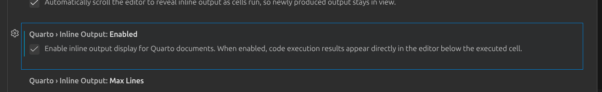

## Positron

### Workspace vs User Settings

Workspace settings can be tracked in GitHub in the `.vscode` folder. User settings are not.

- We can filter for **Modified** settings (`@modified`) to see what settings have been changed.

- Settings can be scoped to a language

  - e.g. `"[quarto]": {...}`

The Preview button next to run all in Positron has "Preview Format...", which allows previewing in different formats.



## Code Cells

“Names with spaces are holes in your soul”

Use code cell names to get errors for different sections.

Searching with `@` the code sell will show up

## YAML

YAML can be changed in the front matter, `_quarto.yml`, and the cell file

## Snippets

Insert snippets for boilerplate code

## Brand

Five keys:

- `meta` - Who the brand belongs to, names, links

- `logo` - Image file(s)

- `color`

- 

### Meta

- For humans only

### Logo

- Path to resolve relative to brand file

- Give alt text

### Color

- Works in two steps:

  1.  **Name** your colors in `pallete`
  2.  Then say what **role** each one plays
      - `primary: forest` NOT `primary: "#1b5e4f"`

``` yml
color:
    palette:
        forest: "#1b5e4f"
    primary: forest
```

## Partials

- Partials don't (or don't really) work within the body whereas params do

- Uses Pandoc syntax

- Using a dot for nested - `$brs-release.period` is the period object within `brs-release`

## Example 2

For example 2, we need to add in the the `<bns-release.*>` - This is a custom value, so it doesn't collide with quarto's meta data. - For example, having masthead so it doesn't collide with quarto's logo

## Example 3

For adding status, make sure that we have the `$brs-release.status$` when adding status

## Typst



- This is a quarto short cut that says "hey look at the meta data and find this information"

<!-- -->

- format in yaml uses the first default

- Quarto headings are offset by 1-level. So a level 3 heading in quarto is actually a level 2 heading in typst.


write_yaml can be used for paramatizing - quarto::write_yaml

check out lua filters